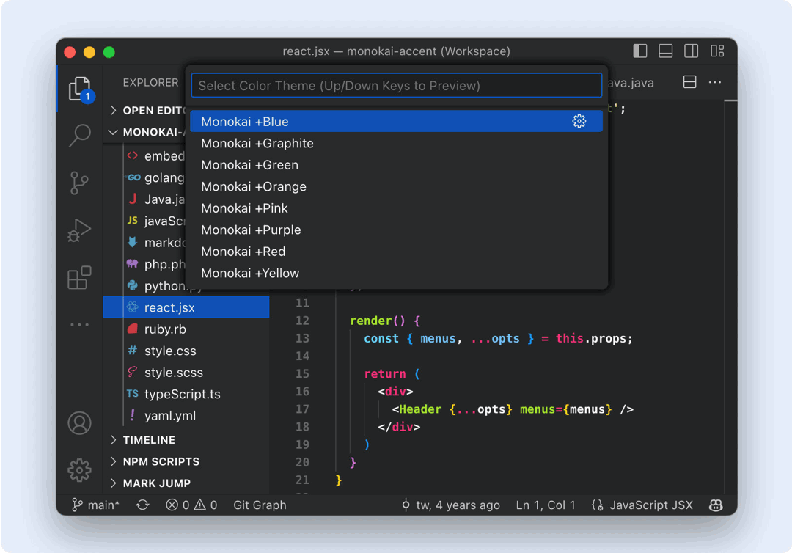
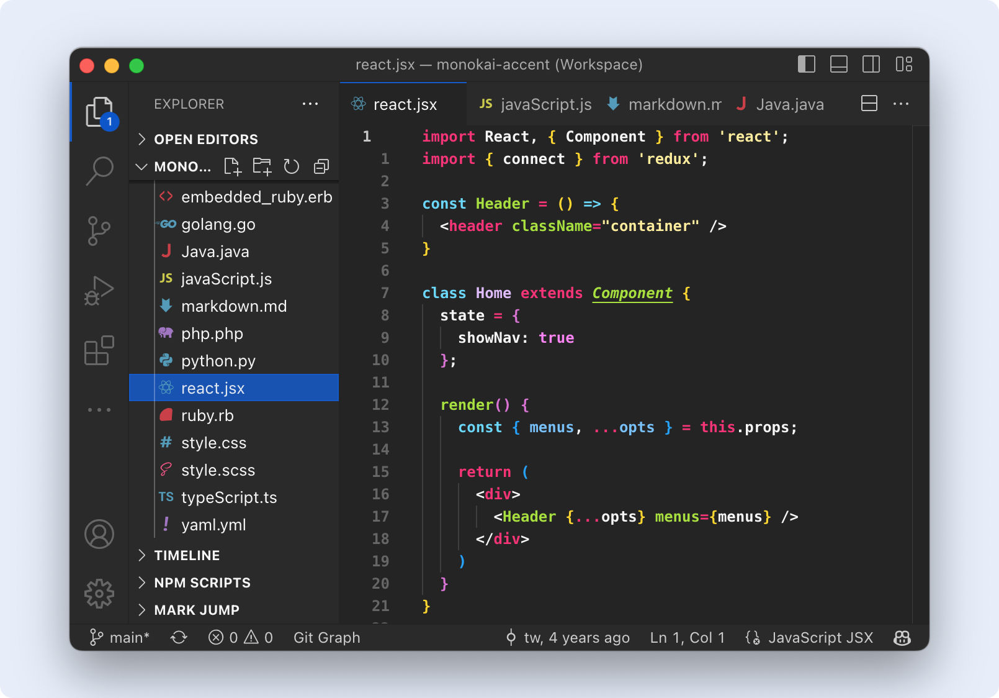
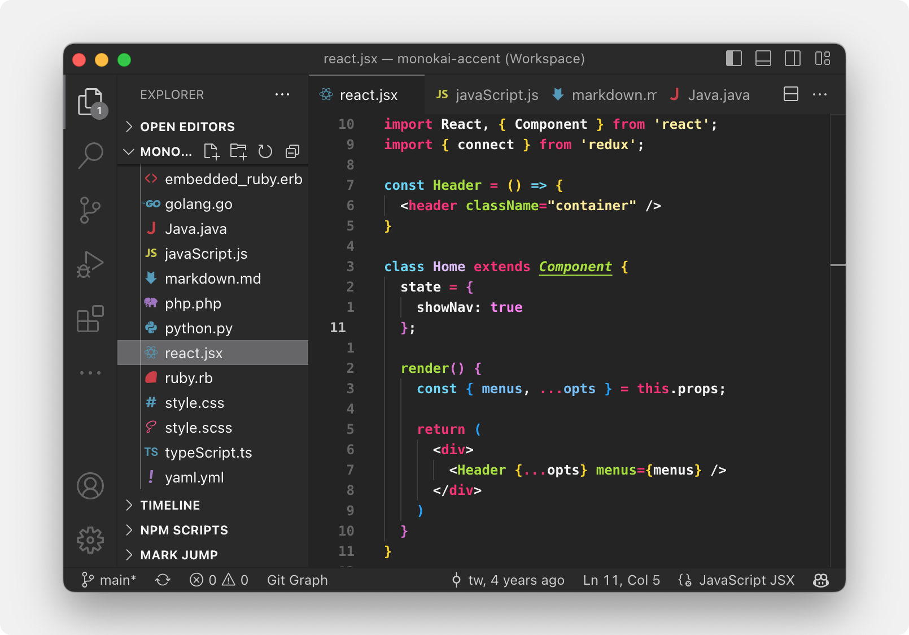
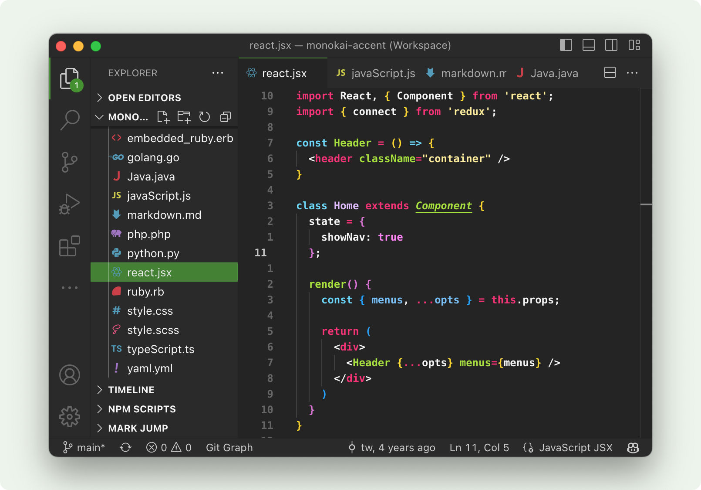
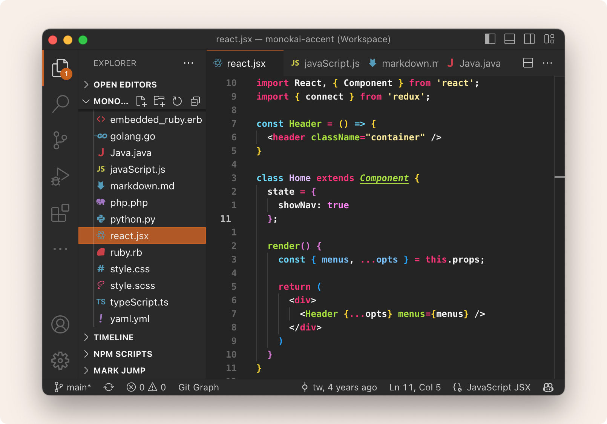
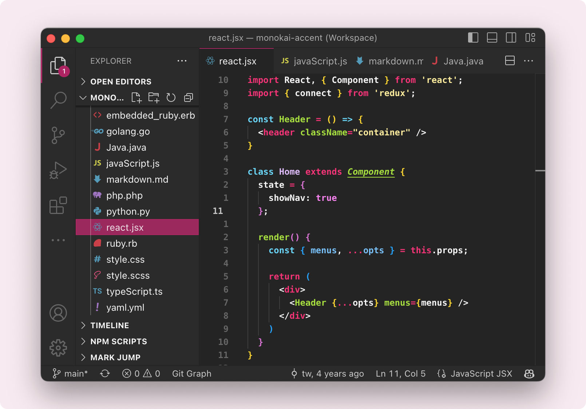
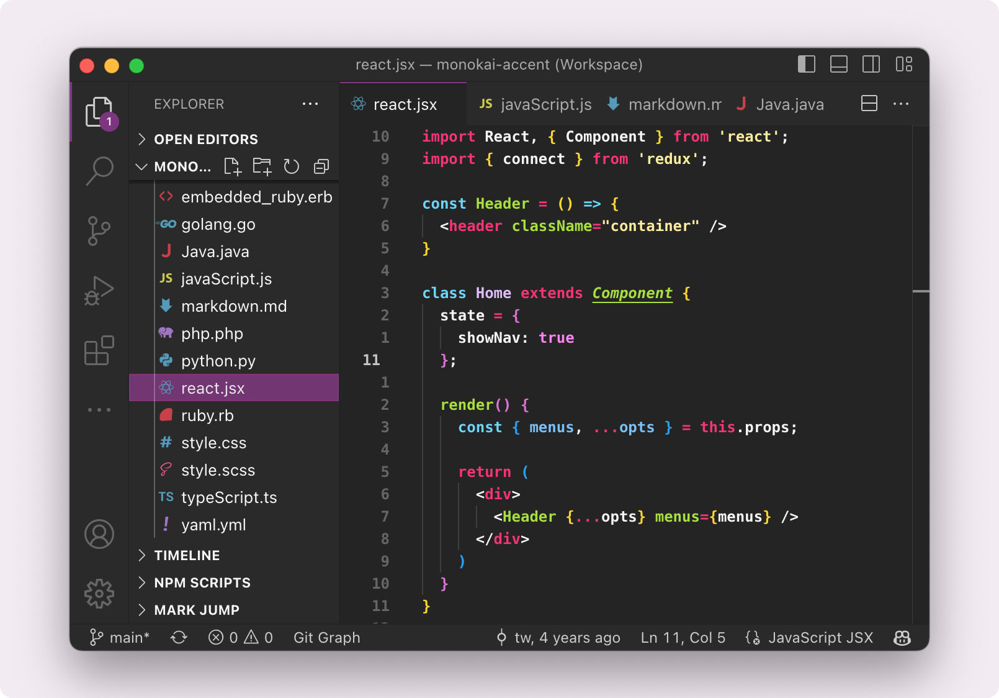
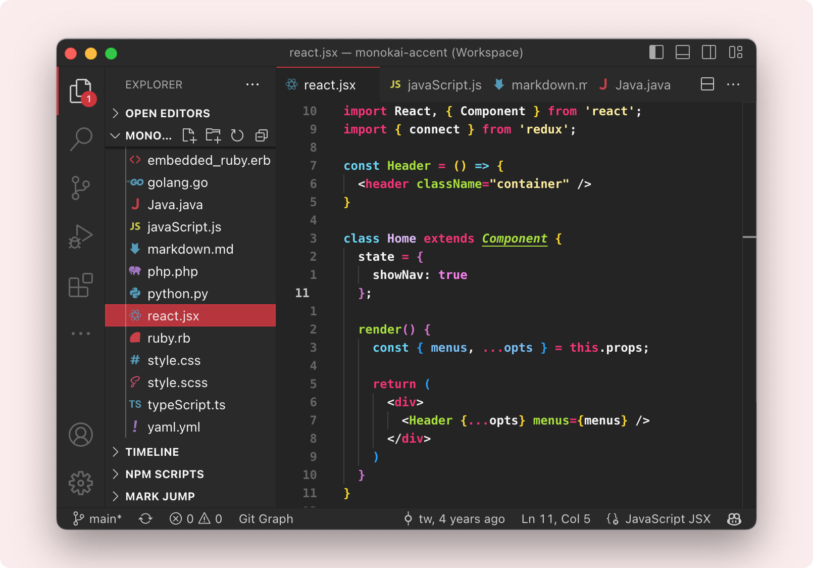
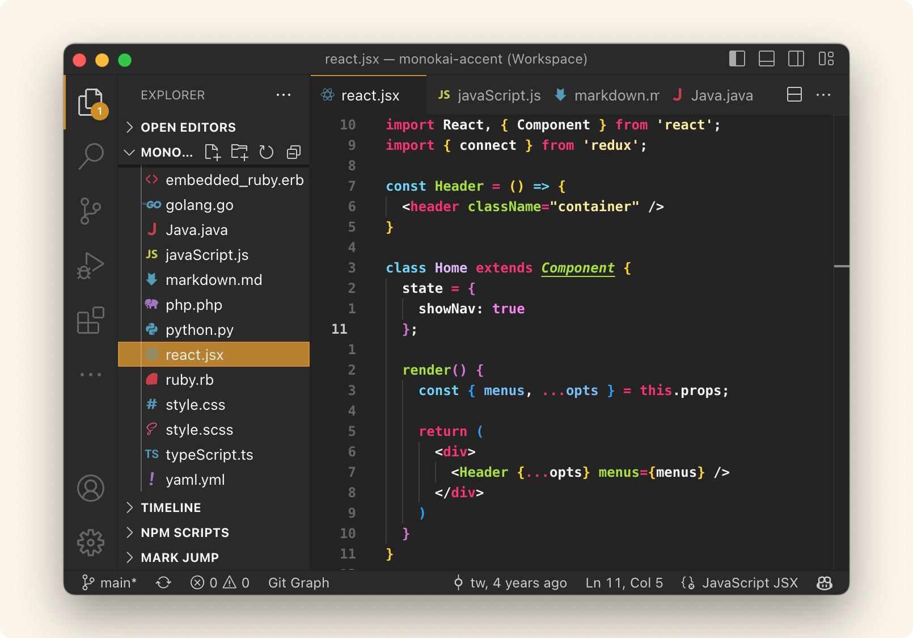

    
    <h1 align="center">Monokai Accents</h2>

A dark Monokai theme with choice of accent color.

  
  
  

* 🌒 Subtle dark neutral editor color scheme
* 📚 Consistent Monokai palette across languages
* 🎨 Choice of vibrant editor accent color: **Blue**, **Graphite**, **Green**, **Orange**, **Pink**, **Purple**, **Red**, **Yellow**

## Install

1.  Open the **Extensions sidebar** in VSCode (*Ctrl/Cmd-Shift-X*).
2.  Search for **Monokai Accents**. Choose the one by **tw**.
3.  Click the **Install** button.
4.  Open the command palette (*Ctrl/Cmd-Shift-P*).
5.  Launch the color theme switcher **Preferences: Color Theme**.
6.  Choose your accent color (ex: **Monokai +Pink**)

## Screenshots

 
<h3 align="center">Monokai +Blue</h3>

 
<h3 align="center">Monokai +Graphite</h3>

 
<h3 align="center">Monokai +Green</h3>

 
<h3 align="center">Monokai +Orange</h3>

 
<h3 align="center">Monokai +Pink</h3>

 
<h3 align="center">Monokai +Purple</h3>

 
<h3 align="center">Monokai +Red</h3>

 
<h3 align="center">Monokai +Yellow</h3>

## Acknowledgements

Inspired by macOS, and Monokai Dark Soda and Remedy themes.
